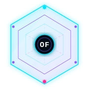
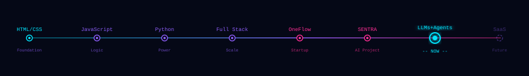

<!-- ONEFLOW OS v2.0 — GitHub Profile README -->

<div align="center">



<br>


<br><br>

[](https://github.com/Prathamesh-Crypto-Coder)
&nbsp;&nbsp;
[](https://linkedin.com/in/prathamesh-sonar)
&nbsp;&nbsp;
[](https://twitter.com/prathamesh_dev)
&nbsp;&nbsp;
[](mailto:prathamesh@oneflow.dev)

<br>


</div>

<div align="center"></div>

<div align="center">

# ▸ SYSTEM.BOOT

</div>

```text
[ONEFLOW OS v2.0] Kernel loading...

[########################################] 100%

[ OK ] Developer Identity...............Prathamesh Sonar
[ OK ] Location..........................India
[ OK ] Education.........................Diploma in Artificial Intelligence
[ OK ] Startup...........................OneFlow  [ACTIVE]
[ OK ] AI Project........................SENTRA   [IN DEVELOPMENT]
[ OK ] Full Stack Skills.................ONLINE
[ OK ] Consistency Engine................ENABLED
[ OK ] Learning Module...................RUNNING
[ OK ] GitHub API........................CONNECTED
[ OK ] Mission...........................BUILDING THE FUTURE

-----------------------------------------------------------
  SYSTEM STATUS : ALL MODULES OPERATIONAL
  UPTIME        : 100%  |  NO DAYS OFF
-----------------------------------------------------------
```

<div align="center"></div>

<div align="center">

# ▸ SYSTEM.IDENTITY

</div>

```python
class PrathameshSonar:
    """
    Full Stack Developer  |  AI Builder  |  Founder of OneFlow
    Diploma in Artificial Intelligence  |  India
    """

    name      : str  = "Prathamesh Sonar"
    alias     : str  = "Prathamesh-Crypto-Coder"
    location  : str  = "India"
    education : str  = "Diploma in Artificial Intelligence"

    role : list = [
        "Full Stack Developer",
        "AI Builder",
        "Founder @ OneFlow",
        "Builder of SENTRA"
    ]

    currently_building : list = [
        "OneFlow  -- startup vision",
        "SENTRA   -- local AI assistant",
        "Full Stack web applications",
        "AI-powered products"
    ]

    stack : dict = {
        "languages"  : ["Python", "JavaScript", "HTML", "CSS"],
        "frontend"   : ["React", "Tailwind CSS", "Vite"],
        "backend"    : ["FastAPI", "Node.js", "Express"],
        "databases"  : ["MongoDB", "MySQL", "SQLite", "Firebase"],
        "ai_tools"   : ["Ollama", "LangChain", "Pandas", "NumPy", "Sklearn"],
        "devtools"   : ["Git", "GitHub", "VSCode", "Linux", "Postman"]
    }

    goal : str = "Build AI-powered software used by millions worldwide."

    def execute(self) -> None:
        while True:
            self.learn()    # something new every day
            self.build()    # something real
            self.ship()     # something that works
            self.improve()  # something existing
```

<div align="center"></div>

<div align="center">

# ▸ DEVELOPER.DASHBOARD

| MODULE | STATUS | PRIORITY | LEVEL |
|:------:|:------:|:--------:|:-----:|
| 💻 Full Stack Development | 🟢 Active | 🔥 Critical | `▓▓▓▓▓▓▓▓▓░` Advanced |
| 🤖 Artificial Intelligence | 🟢 Active | 🔥 Critical | `▓▓▓▓▓▓░░░░` Intermediate |
| 🚀 OneFlow Startup | 🟢 Building | 🔥 Critical | `▓▓▓▓▓▓▓▓░░` Progressing |
| 🧠 SENTRA AI Assistant | 🟡 In Dev | ⚡ High | `▓▓▓▓▓▓░░░░` Building |
| ⚛️ React | 🔵 Learning | ⚡ High | `▓▓▓▓▓▓░░░░` Intermediate |
| ☁️ Cloud & DevOps | 🔵 Learning | ⚡ Medium | `▓▓▓▓░░░░░░` Beginner |
| 📐 System Design | 🔵 Learning | ⚡ Medium | `▓▓▓░░░░░░░` Started |
| ☕ Coffee | 🔋 Required | 🚨 Critical | `▓▓▓▓▓▓▓▓▓▓` Expert |

</div>

<div align="center"></div>

<div align="center">

# ▸ CURRENT.MISSION

### Building products. Learning deeply. Creating the future — one commit at a time.

</div>

<br>

<div align="center">
<table>
<tr>
<td width="33%" align="center" valign="top">
<h3>🚀 BUILDING</h3>
<code>OneFlow</code><br>
<code>SENTRA</code><br>
<code>Full Stack Apps</code><br>
<code>AI Applications</code><br>
<code>Portfolio</code>
</td>
<td width="33%" align="center" valign="top">
<h3>📚 LEARNING</h3>
<code>React</code><br>
<code>Node.js</code><br>
<code>FastAPI</code><br>
<code>LLMs & AI Agents</code><br>
<code>System Design</code>
</td>
<td width="33%" align="center" valign="top">
<h3>🎯 NEXT TARGET</h3>
<code>Advanced LLMs</code><br>
<code>Cloud (AWS/GCP)</code><br>
<code>DevOps</code><br>
<code>SaaS Products</code><br>
<code>Startup Scale</code>
</td>
</tr>
</table>
</div>

<div align="center"></div>

<div align="center">

# ▸ ONEFLOW.OS

</div>

<div align="center">
<table>
<tr>
<td width="28%" align="center" valign="top">
<br>

<br><br>
<h3>🚀 ONEFLOW</h3>

<br>

</td>
<td width="72%" valign="top">
<h3>Mission</h3>
OneFlow is my long-term startup vision — building software products and AI-powered services that solve real-world problems. Every project I build is part of the OneFlow ecosystem.
<br><br>
<strong>Current Focus</strong><br><br>
&nbsp;&nbsp;• 💻 Full Stack Web Applications<br>
&nbsp;&nbsp;• 🤖 AI-Integrated Products<br>
&nbsp;&nbsp;• ⚙️ Scalable Backend Systems<br>
&nbsp;&nbsp;• 🌐 Web Platforms and SaaS<br>
&nbsp;&nbsp;• 📈 Product Development and Growth<br>
<br>
<strong>Startup Dashboard</strong>
<pre>
STATUS       [##################]  ACTIVE
LEARNING     [#################.]  HIGH
PROJECTS     [##################]  FULL
CONSISTENCY  [#################.]  STRONG
SHIPPING     [##############....]  GROWING
</pre>
</td>
</tr>
</table>
</div>

<div align="center"></div>

<div align="center">

# ▸ SENTRA.AI

</div>

<div align="center">
<table>
<tr>
<td width="28%" align="center" valign="top">
<br>

<br><br>
<h3>🤖 SENTRA</h3>

<br>

</td>
<td width="72%" valign="top">
<h3>Overview</h3>
SENTRA is my personal AI assistant — a local intelligent system with context memory, tool calling, streaming responses, and agent behavior. Built to understand how AI is engineered from the ground up.
<blockquote><em>"Not just using AI — building it."</em></blockquote>
<strong>Module Progress</strong>
<pre>
Memory System       [###############]  DONE
Streaming           [################] DONE
FastAPI Backend     [###############]  DONE
Tool Calling        [###########....]  IN PROGRESS
Browser Interface   [############...]  IN PROGRESS
AI Agent Core       [########......]   PLANNED
</pre>
</td>
</tr>
</table>
</div>

<div align="center">

```text
SENTRA ARCHITECTURE

   USER  -->  Browser UI  -->  FastAPI Backend
                                     |
              +----------------------+----------------------+
              |                      |                      |
         Memory Engine          Tool Calling            AI Models
         (Session)              (Browser/FS)            (Ollama)
              |                      |                      |
              +----------------------+----------------------+
                                     |
                           Streaming Response  -->  USER
```

</div>

<div align="center"></div>

<div align="center">

# ▸ INTERACTIVE.TERMINAL

</div>

```bash
prathamesh@oneflow-os:~$ whoami
  Prathamesh Sonar — Full Stack Dev | AI Builder | Founder @ OneFlow

prathamesh@oneflow-os:~$ cat /etc/startup
  OneFlow — Building Software. Building AI. Building the Future.

prathamesh@oneflow-os:~/projects$ ls -la
  drwxr-xr-x  SENTRA/            [IN DEV  ]  Local AI assistant
  drwxr-xr-x  OneFlow-Website/   [ACTIVE  ]  Startup website
  drwxr-xr-x  Portfolio/         [BUILDING]  Developer portfolio
  -rw-r--r--  Resume-Builder/    [COMPLETE]  Resume generator
  drwxr-xr-x  AI-Apps/           [PLANNED ]  Future AI products

prathamesh@oneflow-os:~$ neofetch --minimal
  OS        ONEFLOW OS  v2.0.0
  User      Prathamesh Sonar
  Shell     Python + JavaScript
  Focus     React  Node.js  FastAPI  AI
  Mission   Build products used by millions
  Status    Shipping code daily

prathamesh@oneflow-os:~$ echo $MOTTO
  "Learn. Build. Ship. Improve. Repeat."

prathamesh@oneflow-os:~$ _
```

<div align="center"></div>

<div align="center">

# ▸ PROJECT.REGISTRY

</div>

<div align="center">
<table>
<tr>
<td width="50%" valign="top">
<h3>🚀 ONEFLOW WEBSITE</h3>


<br><br>
Startup website for OneFlow — modern, dark-themed, responsive web presence.
<br><br>
<strong>Stack:</strong> <code>React</code> <code>Vite</code> <code>JavaScript</code> <code>CSS</code>
<br><br>
&nbsp;✦ Cyberpunk UI design system<br>
&nbsp;✦ Fully responsive layout<br>
&nbsp;✦ Startup branding identity<br>
&nbsp;✦ Portfolio showcase<br>
<br>
<code>▓▓▓▓▓▓▓▓▓▓▓▓▓▓░░</code> <strong>87%</strong>
</td>
<td width="50%" valign="top">
<h3>🤖 SENTRA</h3>


<br><br>
Local AI assistant with memory, tool calling, and real-time streaming on Ollama.
<br><br>
<strong>Stack:</strong> <code>Python</code> <code>FastAPI</code> <code>Ollama</code> <code>JavaScript</code>
<br><br>
&nbsp;✦ Context-aware memory<br>
&nbsp;✦ Tool calling system<br>
&nbsp;✦ Real-time streaming<br>
&nbsp;✦ Local LLM integration<br>
<br>
<code>▓▓▓▓▓▓▓▓▓▓░░░░░░</code> <strong>62%</strong>
</td>
</tr>
<tr>
<td width="50%" valign="top">
<h3>📄 RESUME BUILDER</h3>


<br><br>
Clean, responsive resume generator with live preview and PDF export.
<br><br>
<strong>Stack:</strong> <code>HTML</code> <code>CSS</code> <code>JavaScript</code>
<br><br>
&nbsp;✦ Live resume preview<br>
&nbsp;✦ PDF download support<br>
&nbsp;✦ Multiple templates<br>
&nbsp;✦ Responsive design<br>
<br>
<code>▓▓▓▓▓▓▓▓▓▓▓▓▓▓▓▓</code> <strong>100% ✅</strong>
</td>
<td width="50%" valign="top">
<h3>🌐 PORTFOLIO</h3>


<br><br>
Developer portfolio showcasing projects, skills, and the OneFlow brand.
<br><br>
<strong>Stack:</strong> <code>React</code> <code>CSS</code> <code>JavaScript</code>
<br><br>
&nbsp;✦ Personal branding<br>
&nbsp;✦ Projects showcase<br>
&nbsp;✦ Skills visualization<br>
&nbsp;✦ Contact integration<br>
<br>
<code>▓▓▓▓▓▓▓▓▓▓▓▓▓░░░</code> <strong>80%</strong>
</td>
</tr>
</table>
</div>

<div align="center"></div>

<div align="center">

# ▸ TECH.ARSENAL

**💻 Languages**


<br><br>

**⚛️ Frontend**


<br><br>

**⚙️ Backend**


<br><br>

**🗄️ Databases**


<br><br>

**🤖 AI & ML**


<br><br>

**🛠️ Dev Tools**


</div>

<div align="center"></div>

<div align="center">

# ▸ KNOWLEDGE.GRAPH

</div>

<div align="center">

| Skill | Progress | Level |
|:------|:--------:|------:|
| Frontend Development | `▓▓▓▓▓▓▓▓▓▓▓▓▓▓▓▓▓▓▓░` | **90%** |
| Python | `▓▓▓▓▓▓▓▓▓▓▓▓▓▓▓▓▓▓░░` | **82%** |
| Problem Solving | `▓▓▓▓▓▓▓▓▓▓▓▓▓▓▓▓▓░░░` | **85%** |
| Backend Development | `▓▓▓▓▓▓▓▓▓▓▓▓▓▓▓░░░░░` | **72%** |
| FastAPI | `▓▓▓▓▓▓▓▓▓▓▓▓▓▓░░░░░░` | **68%** |
| React | `▓▓▓▓▓▓▓▓▓▓▓▓░░░░░░░░` | **60%** |
| Artificial Intelligence | `▓▓▓▓▓▓▓▓▓▓▓░░░░░░░░░` | **55%** |
| Node.js | `▓▓▓▓▓▓▓▓▓▓░░░░░░░░░░` | **50%** |
| System Design | `▓▓▓▓▓▓▓░░░░░░░░░░░░░` | **35%** ← |

</div>

<div align="center"></div>

<div align="center">

# ▸ LEARNING.TIMELINE



</div>

<div align="center"></div>

<div align="center">

# ▸ MISSION.ROADMAP

</div>

<div align="center">

| Phase | Goals | Status |
|:-----:|:------|:------:|
| 🟢 **SHORT TERM** | Master React · Build APIs with FastAPI & Node.js · Improve Problem Solving | `▓▓▓▓▓▓▓▓▓▓▓▓▓▓▓▓▓▓▓▓` 100% |
| 🟡 **SHORT TERM** | Complete SENTRA AI core · Launch OneFlow website | `▓▓▓▓▓▓▓▓▓▓▓▓░░░░░░░░` 60% |
| 🔵 **MID TERM** | First SaaS product · LLM agents · Cloud deploy · DevOps | `▓▓▓▓▓▓░░░░░░░░░░░░░░` 30% |
| 🔵 **LONG TERM** | AI products at scale · Engineering team · Global OneFlow | `▓▓▓░░░░░░░░░░░░░░░░░` 15% |

</div>

<div align="center"></div>

<div align="center">

# ▸ GITHUB.ANALYTICS


&nbsp;


<br><br>


</div>

<div align="center"></div>

<div align="center">

# ▸ CONTRIBUTION.UNIVERSE


</div>

<div align="center"></div>

<div align="center">

# ▸ ACHIEVEMENTS


<br><br>

| Trophy | Description | Status |
|:------:|:------------|:------:|
| 🚀 Startup Founder | Founded OneFlow startup | ✅ Active |
| 🤖 AI Engineer | Building SENTRA from scratch | 🟡 In Progress |
| 💻 Full Stack Developer | React + Node.js + FastAPI | ✅ Active |
| 📦 Product Shipper | Completed Resume Builder v1.0 | ✅ Done |
| 📚 Daily Learner | Learning consistently every day | ✅ Ongoing |
| 🎯 Mission-Driven | Building with real purpose | ✅ Always |

</div>

<div align="center"></div>

<div align="center">

# ▸ PHILOSOPHY.LOG

</div>

<div align="center">
<table>
<tr>
<td width="55%" valign="top">
<h3>💭 Why I Build</h3>
<blockquote>
<p>I don't build projects to fill my GitHub profile.</p>
<p>I build because every application teaches something no tutorial can.</p>
<p>Every bug improves my debugging. Every feature sharpens my mindset. Every project pushes me toward products people genuinely use.</p>
<p>My destination isn't just becoming a developer — it's becoming someone capable of building technology that creates real impact.</p>
</blockquote>
<br>
<pre>
  "Success isn't built in a
   single breakthrough.

   It's built through thousands
   of small improvements that
   nobody notices."

           -- Prathamesh Sonar
</pre>
</td>
<td width="45%" valign="top">
<h3>⚙️ Core Principles</h3>
<br>
&#10022; &nbsp;<strong>Learn Deeply</strong> — not just surface level<br><br>
&#10022; &nbsp;<strong>Build Consistently</strong> — every single day<br><br>
&#10022; &nbsp;<strong>Write Clean Code</strong> — always maintainable<br><br>
&#10022; &nbsp;<strong>Solve Real Problems</strong> — not fake ones<br><br>
&#10022; &nbsp;<strong>Ship Fast</strong> — iterate even faster<br><br>
&#10022; &nbsp;<strong>Never Stop Improving</strong> — always<br>
<br><br>
<h3>🔄 Daily Loop</h3>
<pre>
while (alive) {
  learn()    // something new
  build()    // something real
  debug()    // something broken
  improve()  // something existing
  repeat()   // forever
}
</pre>
</td>
</tr>
</table>
</div>

<div align="center"></div>

<div align="center">

# ▸ CONNECTION.PROTOCOL

### Connecting with developers, builders, and founders who think big.

<br>

[](https://github.com/Prathamesh-Crypto-Coder)
&nbsp;&nbsp;
[](https://linkedin.com/in/prathamesh-sonar)
&nbsp;&nbsp;
[](https://twitter.com/prathamesh_dev)
&nbsp;&nbsp;
[](mailto:prathamesh@oneflow.dev)

<br>

```text
OPEN TO:  Collaboration  x  Projects  x  AI Discussions  x  Startup Ideas
```

<br>



</div>
